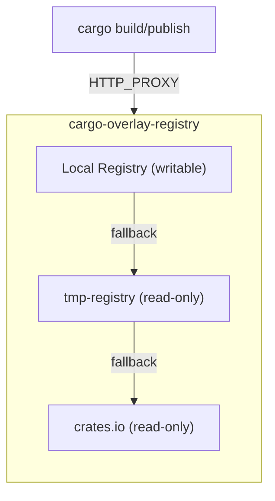

# cargo-overlay-registry

A read-write overlay layer for cargo registries. Like an overlay filesystem, it provides a writable local layer on top of a read-only upstream registry (e.g., crates.io). Publishes go to the local layer, while reads fall through to the upstream when not found locally.

## How It Works



- **Local Registry**: Receives publishes (`-r local`)
- **tmp-registry**: Temp registry created by `cargo publish` (`-r local=./target/package/tmp-registry`)
- **crates.io**: Upstream fallback (`-r crates.io`)

- **Publish**: Crates are stored in the top-most overlay (for local registries only; remote layers are read-only)
- **Download**: Local crates are served first; missing crates fall through to the next layer
- **Index**: Indexes from all layers are merged from top to bottom; top layers win conflicts

Multiple registry layers can be stacked using the `-r` flag.

## Use Case: Dry-Run Publishing

Until recently, `cargo publish --workspace` was unstable. Now it's stable — but it still breaks if any crate has a build script that invokes `cargo` (e.g., to run `cargo metadata` or build another crate). The inner cargo process tries to resolve workspace dependencies that haven't been published yet.

The overlay solves this by capturing publishes locally while still resolving real dependencies from upstream. Build scripts see all workspace crates as if they were already published.

## Installation

```bash
cargo install --path .
```

## Quick Start

### 1. Start the overlay

```bash
cargo-overlay-registry
```

### 2. Configure cargo

Set the environment variables shown in the server output:

```bash
export CARGO_HTTP_PROXY="https://127.0.0.1:8080"
export CARGO_HTTP_CAINFO="/tmp/cargo-overlay-registry-ca.pem"
export CARGO_REGISTRY_TOKEN=dummy
```

### 3. Use cargo normally

```bash
# Builds use local crates + upstream fallback
cargo build

# Publishes go to the local overlay
cargo publish --allow-dirty
```

## Quick Publish Test

Use `--` to run a command with the proxy already configured:

```bash
# Test publishing a single crate
cargo-overlay-registry -- cargo publish --allow-dirty

# Publish a workspace
cargo-overlay-registry -- cargo publish --workspace --allow-dirty
```

The proxy starts, sets `CARGO_HTTP_PROXY`, `CARGO_HTTP_CAINFO`, and `CARGO_REGISTRY_TOKEN` for the child process, runs the command, and exits with its exit code.

Metadata validation is enforced by default (same as crates.io), so you can verify your crate meets publishing requirements before actually publishing. Use `--permissive-publishing` to skip validation.

### Build Scripts That Invoke Cargo

When publishing a workspace, `cargo publish` packages each crate to `<target>/package/tmp-registry` before building and validating. If a crate has a build script that invokes `cargo` (e.g., to build another crate or run `cargo metadata`), that inner cargo process needs to resolve dependencies — including workspace crates that were just packaged.

Add a local registry layer pointing to the tmp-registry:

```bash
cargo-overlay-registry \
  -r local=./my-registry \
  -r local=./target/package/tmp-registry \
  -r crates.io \
  -- cargo publish --workspace --allow-dirty
```

This ensures build scripts can resolve workspace crates that have been packaged but not yet published.

## Options

| Option | Short | Default | Description |
|--------|-------|---------|-------------|
| `--port` | `-p` | 8080 | Server port (registry + proxy) |
| `--host` | `-H` | 0.0.0.0 | Host to bind to |
| `--registry` | `-r` | `local` + `crates.io` | Registry layers (see below) |
| `--no-proxy` | | | Disable proxy mode (CONNECT handling with MITM) |
| `--read-only` | | | Make the registry read-only (reject all publish requests) |
| `--ca-cert-out` | | (temp file) | Export CA certificate for HTTPS interception |
| `--permissive-publishing` | | | Skip crates.io metadata validation |
| `--no-tls` | | | Disable HTTPS (use plain HTTP) |
| `--tls-cert` | | | TLS certificate file (PEM) |
| `--tls-key` | | | TLS private key file (PEM) |

### Registry Layers (`-r`)

Registry layers are stacked top-to-bottom. The topmost local registry receives publishes (unless `--read-only` is set); reads check each layer in order.

| Syntax | Description |
|--------|-------------|
| `-r local` | Local registry in a temp directory |
| `-r local=/path` | Local registry at the specified path |
| `-r crates.io` | Shortcut for crates.io remote |
| `-r remote=URL` | Custom remote registry (URL used for both API and index) |
| `-r remote=API,INDEX` | Custom remote with separate API and index URLs |

**Examples:**

```bash
# Default: local temp dir + crates.io
cargo-overlay-registry

# Local registry at specific path + crates.io
cargo-overlay-registry -r local=./my-registry -r crates.io

# Stack multiple layers: writable local, shared local, crates.io
cargo-overlay-registry -r local -r local=/shared/crates -r crates.io

# Read-only mode (no publishing allowed)
cargo-overlay-registry --read-only -r local=./my-registry -r crates.io
```

## Example: Publishing Dependent Crates

```bash
# Start the overlay
cargo-overlay-registry

# In another terminal, configure cargo (paths shown in server output)
export CARGO_HTTP_PROXY="https://127.0.0.1:8080"
export CARGO_HTTP_CAINFO="/tmp/cargo-overlay-registry-ca.pem"
export CARGO_REGISTRY_TOKEN=dummy

# Publish my-core (stored locally, not on crates.io)
cd my-core
cargo publish --allow-dirty

# Publish my-app which depends on my-core
# The overlay serves my-core from the local layer
cd ../my-app
cargo publish --allow-dirty

# Build a project that uses my-app
# The overlay serves my-app and my-core locally,
# fetches other dependencies from crates.io
cd ../test-project
cargo build
```

## Technical Details

### MITM TLS Interception

The overlay intercepts HTTPS traffic to crates.io domains using MITM TLS:
- Generates certificates on-the-fly signed by the overlay's CA
- Non-registry traffic passes through unmodified
- Use `CARGO_HTTP_CAINFO` to trust the CA certificate

### Storage Layout

```
{registry-path}/
├── {name}-{version}.crate           # Published .crate files (flat)
└── index/{prefix}/{name}            # Index entries (JSON lines)
```

The prefix follows cargo's sparse index convention: `1/` for single-char names, `2/` for two-char, `3/{first-char}/` for three-char, and `{first-two}/{second-two}/` for longer names.

### Registry API

Implements the [Cargo Registry HTTP API](https://doc.rust-lang.org/cargo/reference/registry-web-api.html):
- `GET /config.json` — Registry configuration
- `GET /{first-two}/{second-two}/{crate}` — Index lookup (merged with upstream)  
- `GET /api/v1/crates/{name}/{version}/download` — Crate download (local-first)
- `PUT /api/v1/crates/new` — Publish (stored locally)

## License

Apache-2.0
